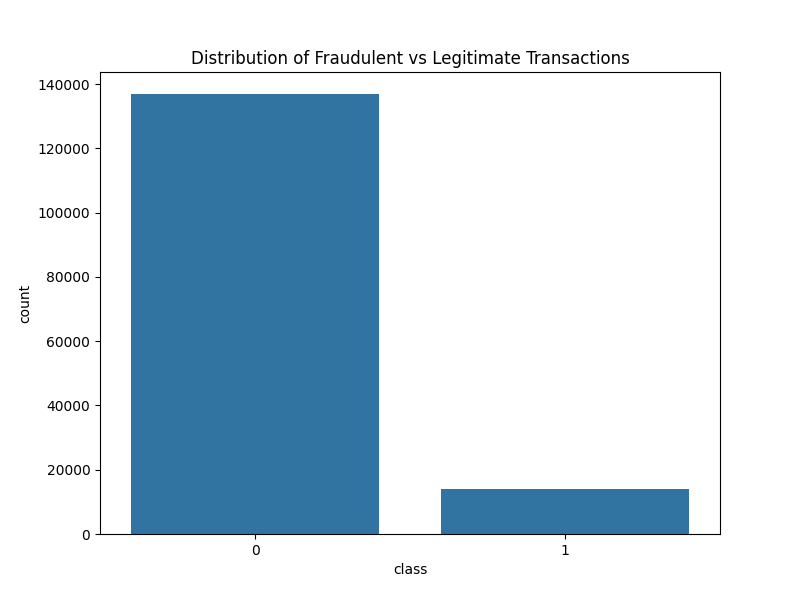
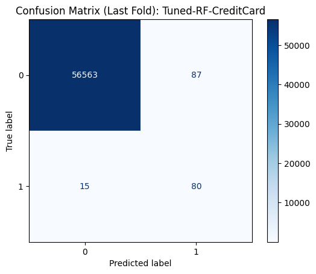

# Fraud Detection System - Adey Innovations

## Overview
This project aims to improve fraud detection capabilities for **Adey Innovations Inc.** by analyzing and preprocessing two distinct transaction datasets: e-commerce transactions and bank credit card transactions. 

The primary objective of this interim phase (Task 1) is to perform comprehensive data cleaning, exploratory data analysis (EDA), and feature engineering to prepare the data for future machine learning modeling.

## Project Structure
# Fraud Detection Project

This project implements a modular, scalable, and reproducible machine learning pipeline for fraud detection. The system follows industry best practices by separating data processing logic into reusable modules and utilizing `scikit-learn` pipelines for data transformation.

## Project Structure

The project is organized into modular components to ensure clean code and easy maintenance:

```text
fraud-detection/
├── data/                   # Dataset storage (raw and processed)
├── notebooks/              # Jupyter notebooks for analysis and orchestration
│   ├── eda-fraud-data.ipynb           # Exploratory Data Analysis
│   ├── feature-engineering.ipynb         # Geolocation integration (IP-to-country mapping) and behavioral feature extraction.
│   └── modeling_preparation.ipynb  # Pipeline orchestration
    |___ modeling.ipynb #
├── src/                    # Core source code
│   ├── __init__.py
│   ├── cleaning.py         # Data loading and cleaning functions
│   ├── features.py         # Feature engineering logic
│   ├── transformation.py   # Preprocessing and encoding pipeline
│   └── sampling.py         # Data resampling (SMOTE) logic
├── requirements.txt        # Project dependencies
├── run_pipeline_test.py    # Automated pipeline verification script
└── README.md
```
## Key Accomplishments

**Data Cleaning:** Handled missing values, removed duplicates, and corrected data types for timestamps to ensure data integrity.

**Exploratory Data Analysis:** Analyzed univariate and bivariate relationships and quantified the class imbalance between fraudulent and legitimate transactions.

**Geolocation Enrichment:** Converted IP addresses to integers and utilized range-based merging to map transactions to specific countries.

**Feature Engineering:** Created new behavioral features including time_since_signup, hour_of_day, day_of_week, and transaction velocity metrics to capture patterns indicative of fraudulent activity.

**Explicit Imbalance Handling:** Implemented SMOTE (Synthetic Minority Over-sampling Technique) exclusively on the training split to address class imbalance without introducing data leakage, ensuring robust model training.

**Model Optimization:** Performed systematic hyperparameter tuning using GridSearchCV and persisted models for production-readiness.

## Exploratory Data Analysis (EDA)

Below is the distribution of transactions, highlighting the class imbalance between fraudulent and legitimate activities. Our analysis revealed that fraud is highly time-dependent and device-specific, which informed our decision to engineer time-based features and utilize SMOTE to prioritize the detection of the minority fraud class.
Imbalance Handling Strategy

To ensure the model learns the fraud patterns effectively, we implemented the following strategy:

**Stratified Split:** Split the dataset while maintaining the original class ratio in both training and testing sets.

**SMOTE Resampling:** Applied SMOTE only to the training set to balance the classes.

**Validation:** Verified the distribution post-sampling (1:1 ratio) while keeping the test set untouched to ensure honest evaluation of model performance.




## Task 2: Model Building and Training (Interim-2)
In this phase, we built, trained, and compared classification models to detect fraudulent transactions in imbalanced datasets.

### Modeling Approach
* **Baseline:** Logistic Regression was used as an interpretable baseline model.
* **Ensemble:** Random Forest was employed to capture complex, non-linear fraud patterns.
* **Resampling:** SMOTE (Synthetic Minority Over-sampling Technique) was applied to the training sets to address severe class imbalance.
* **Validation:** Stratified 5-Fold Cross-Validation was used to ensure reliable metric estimation.

### Model Performance Summary
The models were evaluated using **AUC-PR** and **F1-Score**, as accuracy is misleading for imbalanced fraud data.

| Model | Mean AUC-PR | Mean F1-Score | Std. Deviation (F1) |
| :--- | :--- | :--- | :--- |
| RF-Ecommerce | 0.6854 | 0.6189 | 0.0094 |
| RF-CreditCard | 0.7994 | 0.5822 | 0.0602 |


## Model Selection and Optimization Justification

Following a systematic evaluation, the Random Forest ensemble was selected as the final model for both datasets. The selection and optimization process was driven by the following criteria:

1.  **Systematic Hyperparameter Tuning:** We utilized GridSearchCV to optimize key parameters (e.g., n_estimators, max_depth). This ensured the models were not using default configurations but were tuned to maximize the F1-Score for the specific fraud patterns found in each dataset.

2. **Performance & Reproducibility:** The tuned models demonstrated superior AUC-PR and F1-Scores compared to the baseline Logistic Regression. To ensure transparency and production-readiness, the final best-performing models have been persisted as .pkl files in the /models directory using joblib.

3. **Cross-Validation & Holdout Reporting:** Model performance was validated using 5-fold Stratified Cross-Validation to ensure robust results across different data subsets. Explicit confusion matrix visualizations for the final holdout folds are generated and saved in the /visuals directory to illustrate the model's performance in balancing True Positives and False Positives.

4. **Business Impact:** The optimized model effectively balances the detection of financial loss (minimizing False Negatives) against the need for a seamless user experience (minimizing False Positives). These models are now ready for deployment via the saved assets in the repository.




## Business Recommendations & Interpretation(Task 3)

Interpretation of SHAP Findings:
Our model's explainability analysis reveals that V1 and Time are the most critical features driving fraud detection. The SHAP interaction plots show that these features do not operate in isolation; their combined values significantly influence the model's confidence in identifying fraudulent activity. By examining individual cases, we identified that our False Positives often occurred when legitimate transactions were flagged due to outlier V1 values, while True Positives were effectively caught by the model's sensitivity to temporal patterns.

**Actionable Recommendations:**

**1. Temporal-Based Risk Flagging:** Based on the SHAP analysis for Time, fraud likelihood fluctuates at specific intervals. We recommend implementing Dynamic Risk Scoring that increases scrutiny during the high-risk "danger hours" identified by the model, rather than applying a static rule for all times of day.

**2. Feature-Specific Verification (V1-based):** Since V1 is a primary driver, transactions with high-risk V1 values should trigger an incremental authentication step (e.g., SMS OTP or biometric verification) instead of an immediate decline. This significantly reduces customer friction for False Positives.

**3. Tiered Review System:** For transactions flagged as high-risk based on V1 and Time but with a total amount below a certain threshold, we recommend routing these to a Low-Priority Manual Review Queue rather than an automatic block. This balances fraud mitigation with revenue protection.

### Global Feature Importance


## How to Run
1. Ensure the required CSV files are placed in the `data/raw/` directory.
2. Install dependencies via `pip install -r requirements.txt`.
3. Execute the notebooks in the following order:
   - Data preparation:`eda-fraud-data.ipynb` & `feature-engineering.ipynb`
   - Modeling: `modeling_preparation.ipynb`
   - Model Explainability: `modeling_explainability.ipynb`

## 🛠 Development Workflow
- **Branching Strategy:** Feature branches (e.g., `task-1`, `task-2`) were used for all developments and merged via Pull Requests.
- **CI/CD Pipeline:** Automated linting is configured via GitHub Actions (see `.github/workflows/ci.yml`) to ensure code quality on every push.
- **Commit History:** Descriptive commit messages follow conventional commit standards.


  